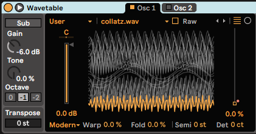
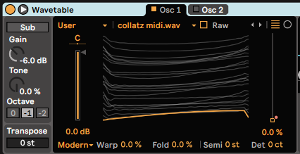
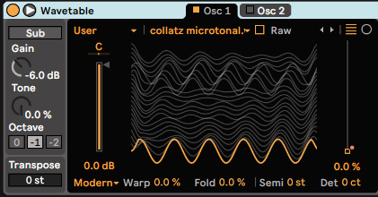

# Collatz Sequence Music

This is a set of Python scripts that generate music and sound based on the Collatz sequence, a mathematical concept. Here's a brief description of each script:

- `collatz_resequencer.py`: This script takes an input .wav file and resequences it according to the Collatz sequence, producing a new .wav file as output. The starting point of the Collatz sequence can be set with the --collatz-base argument.

Example usage from the command line:
```
python collatz_resequencer.py input.wav output.wav --collatz-base 10
```

- `gen_collatz.py`: This script generates a .wav file where each sample's frequency is determined by the Collatz sequence.

- `gen_collatz_microtonal.py`: This script generates a .wav file with a series of microtonal frequencies determined by the Collatz sequence.

- `gen_collatz_midi.py`: This script generates a MIDI file where the note values are determined by the Collatz sequence.

Feel free to experiment with these scripts and modify them to suit your needs. If you create any interesting sounds or music with these scripts, we'd love to hear it!

## Contributing

If you want to contribute, just fork and PR. Make sure you include the wav result from the script you contribute. Do not limit yourself to Collatz Conjecture either however named this repo is :)

## Screenshots

See how these samples look when loaded into Ableton Live's Wavetable instrument:

### samples/collatz.wav

This is a very useful sample, but be advised the frequency range of samples might go above the human hearing limit of 20~22khz
### samples/collatz_midi.wav
Yes, this one sounds as it looks: bland. What would you do with it? Share!

### samples/collatz_microtonal.wav

